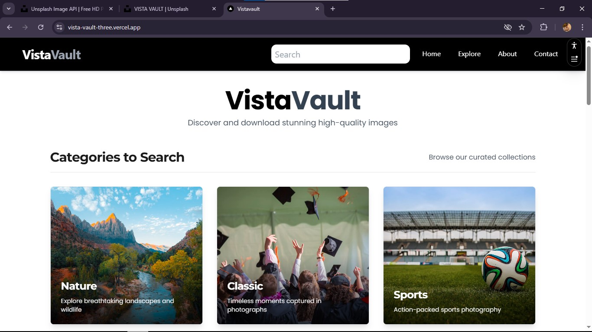

# VISTA-VAULT - Professional Image Gallery Platform

VISTA-VAULT is a modern, high-performance image gallery platform that provides users with access to stunning, high-quality photographs from around the world. Built with Next.js and powered by the Pexels API, it offers a seamless experience for discovering, viewing, and downloading professional photography.



## 🌟 Features

- **Curated Image Gallery**: Browse thousands of high-quality, professional photographs
- **Advanced Search**: Find images by keywords, categories, and topics
- **Category Browsing**: Explore organized collections including Nature, Architecture, Sports, Food, and more
- **Image Preview Modal**: View images in full resolution with download and share options
- **Responsive Design**: Optimized for desktop, tablet, and mobile devices
- **Blur Placeholders**: Enhanced loading experience with generated blur placeholders
- **Pagination**: Efficient navigation through large image collections
- **SEO Optimized**: Server-side rendering for better search engine visibility

## 🚀 Getting Started

### Prerequisites

- Node.js (v16.0.0 or higher)
- npm, yarn, pnpm, or bun
- Pexels API Key

### Installation

1. Clone the repository:
   ```bash
   git clone https://github.com/Omm-codes/vista-vault.git
   cd vista-vault
   ```

2. Install dependencies:
   ```bash
   npm install
   # or
   yarn install
   # or
   pnpm install
   # or
   bun install
   ```

3. Create a `.env.local` file in the root directory with your Pexels API key:
   ```env
   PEXELS_API_KEY=your_pexels_api_key_here
   ```

4. Start the development server:
   ```bash
   npm run dev
   # or
   yarn dev
   # or
   pnpm dev
   # or
   bun dev
   ```

5. Open [http://localhost:3000](http://localhost:3000) to view the app in your browser.

## 📱 Key Features & Usage

### Image Gallery
Browse curated collections of professional photographs with infinite scroll and grid layout optimization.

### Search Functionality
Use the search bar to find specific images by keywords. The search supports various topics and returns relevant, high-quality results.

### Category Exploration
Navigate through organized categories including:
- Nature & Landscapes
- Architecture & Buildings
- Sports & Action
- Food & Culinary
- Portraits & People
- Abstract & Creative
- And many more...

### Image Viewing
Click on any image to view it in full resolution with options to:
- Download the image
- Share via social media or copy link
- View in a new tab

### Mobile Experience
Enjoy a fully responsive design with a dedicated mobile footer for easy navigation on mobile devices.

## 🔧 Technologies Used

- **Next.js 14**: React framework with App Router for server-side rendering
- **TypeScript**: Type-safe development
- **Tailwind CSS**: Utility-first CSS framework for styling
- **Zod**: Schema validation for API responses
- **Pexels API**: Source for high-quality stock photography
- **Plaiceholder**: Generates blur placeholders for images
- **Framer Motion**: Smooth animations and transitions
- **Vercel Analytics**: Performance monitoring and analytics

## 📁 Project Structure

```
vista-vault/
├── src/
│   ├── app/
│   │   ├── components/
│   │   │   ├── Gallery.tsx
│   │   │   ├── ImgContainer.tsx
│   │   │   ├── ImageModal.tsx
│   │   │   ├── Navbar.tsx
│   │   │   ├── Search.tsx
│   │   │   ├── Footer.tsx
│   │   │   ├── CategorySection.tsx
│   │   │   └── MobileFooter.tsx
│   │   ├── categories/
│   │   │   ├── page.tsx
│   │   │   └── [slug]/
│   │   │       └── page.tsx
│   │   ├── results/
│   │   │   └── [...myParams]/
│   │   │       └── page.tsx
│   │   ├── search/
│   │   │   └── page.tsx
│   │   ├── about/
│   │   │   └── page.tsx
│   │   ├── contact/
│   │   │   └── page.tsx
│   │   ├── layout.tsx
│   │   ├── page.tsx
│   │   └── globals.css
│   ├── lib/
│   │   ├── fetchImages.ts
│   │   ├── getBase64.ts
│   │   ├── getPrevNextPages.ts
│   │   ├── getPhotos.ts
│   │   └── env.ts
│   └── models/
│       └── Images.ts
├── public/
├── .env.local
├── next.config.js
├── tailwind.config.js
├── package.json
└── README.md
```

## 🎨 Design Philosophy

VISTA-VAULT follows a clean, minimalist design approach that puts the focus on the imagery. The platform uses:

- **Typography**: Montserrat for headings and Poppins for body text
- **Color Scheme**: Primarily black and white with subtle grays for a timeless look
- **Layout**: Grid-based masonry layout for optimal image presentation
- **Navigation**: Intuitive navigation with breadcrumbs and clear categorization

## ⚡ Performance Optimizations

- **Image Optimization**: Next.js Image component with blur placeholders
- **Server-Side Rendering**: Fast initial page loads
- **Lazy Loading**: Images load as they come into viewport
- **Caching**: Efficient API response caching
- **Bundle Optimization**: Tree shaking and code splitting

## 🤝 Contributing

We welcome contributions to VISTA-VAULT! To contribute, please follow these steps:

1. Fork the repository
2. Create a new branch (`git checkout -b feature/YourFeature`)
3. Make your changes and commit them (`git commit -m 'Add some feature'`)
4. Push to the branch (`git push origin feature/YourFeature`)
5. Open a pull request

Please ensure your code follows the project's coding standards and includes appropriate TypeScript types.

## 📄 License

This project is licensed under the MIT License - see the [LICENSE](LICENSE) file for details.

## 🙏 Acknowledgments

- [Pexels](https://www.pexels.com/) for providing access to high-quality stock photography
- [Next.js](https://nextjs.org/) team for the excellent React framework
- [Vercel](https://vercel.com/) for hosting and deployment platform

## 📞 Contact

For inquiries or support, please contact:

- Developer: Om Sanjay - [omsanjay975@gmail.com](mailto:omsanjay975@gmail.com)
- GitHub: [Omm-codes](https://github.com/Omm-codes)
- Project Link: [https://github.com/Omm-codes/vista-vault](https://github.com/Omm-codes/vista-vault)

---

Thank you for choosing VISTA-VAULT for your image discovery needs. Explore the world through stunning photography!
